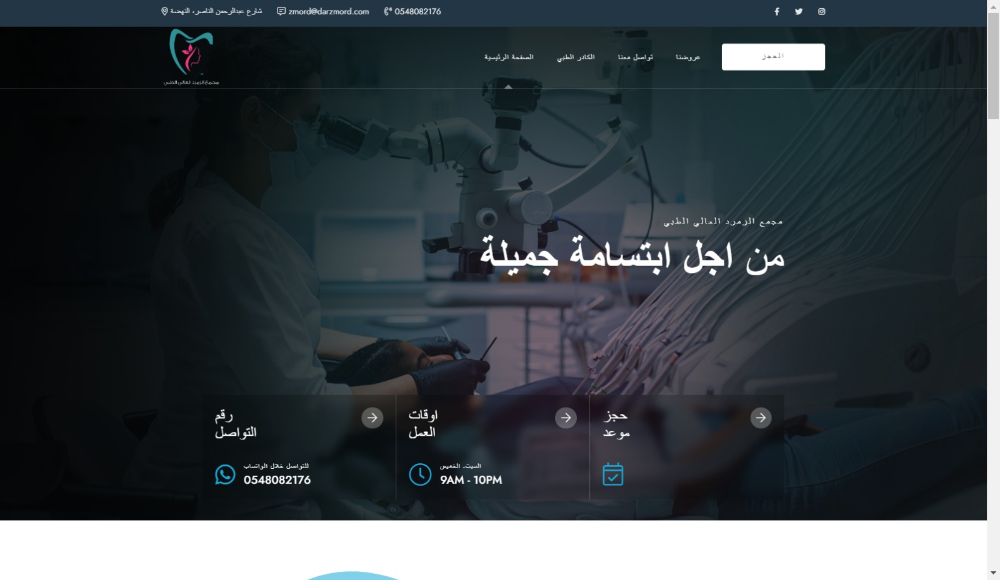
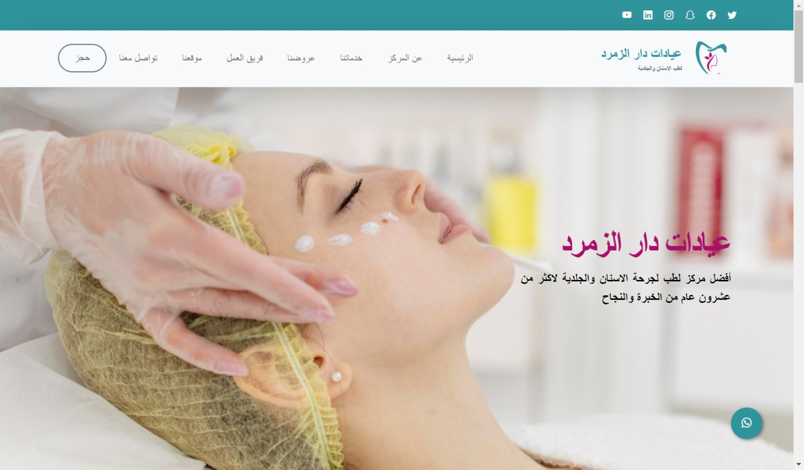
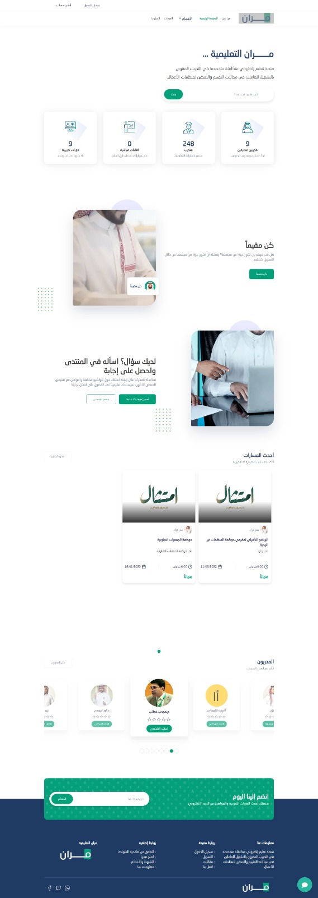
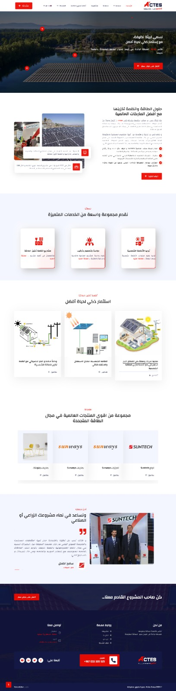
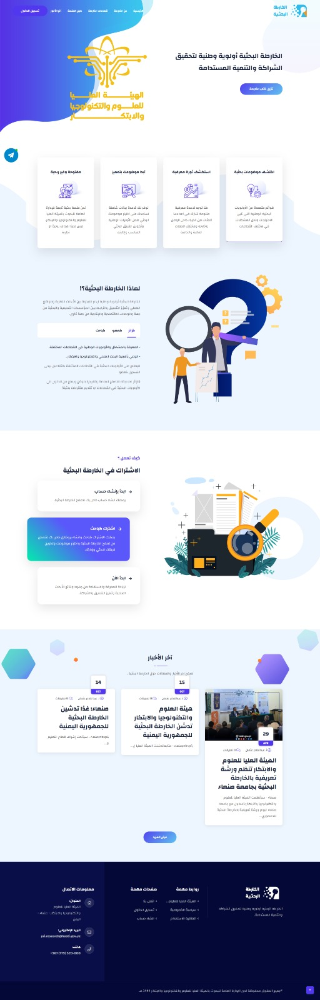
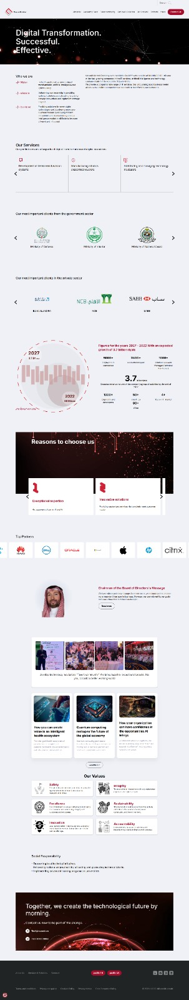

<h1 align="center">Hi 👋, I'm Dhiaa Mostafa</h1>
<h3 align="center">Senior Software Engineer | DevOps & Full Stack Specialist</h3>
---

## 👨‍💻 Who am I?

I'm a developer with experience in building **websites, web apps, and mobile apps** for small and medium-sized businesses.  
I specialize in **HTML, CSS, PHP, jQuery, Laravel, and Flutter**, ensuring full project management from start to finish with clear communication along the way.

---

## 💼 Experience

### 🟢 2023 – Present: Senior Software Engineer  
**Eyein Technology – Saudi Arabia**
- Developed a cloud-based accounting system (**Evix**)
- Built logistics tracking systems
- Designed multi-tenant SaaS applications
- Led ERP and CRM system development
- Integrated advanced authentication systems

### 🟡 2022 – 2023: Full Stack Developer  
**SMART SYSTEM – Saudi Arabia**
- Built restaurant & hotel management systems
- Managed Agile-based projects
- Delivered high-quality websites across industries

### 🔵 2020 – 2022: Full Stack Developer  
**ESKYSOFT – Yemen**
- Developed school, e-commerce, and booking platforms
- Maintained quality and performance standards
- Employed Agile methodologies

---

## 🎓 Education

**Bachelor in Information Technology (2017–2021)**  
University of Ibb – Yemen  
- Faculty of Science & Technology  
- Department of Information Technology

---

## 🛠️ Skills

- **Frontend**: HTML5, CSS3, Bootstrap, SASS, JavaScript, JQuery, TypeScript, AJAX  
- **Frameworks**: Laravel, React, Next.js, Node.js  
- **Mobile**: Flutter & Dart  
- **Backend**: PHP, RESTful APIs  
- **Databases**: SQL Server, MySQL, SQLite  
- **DevOps & Tools**: Docker, Kubernetes, Git, GitHub, GitLab  
- **Cloud**: AWS, Azure  
- **Business Systems**: ERP, CRM, SaaS, Multi-Tenant Apps  
---

## 🧩 Portfolio Highlights

| Project | Description | Preview |
|--------|-------------|---------|
| **Miranedu** | Specialized Educational Platform |  |
| **Actes Group** | ACTS Energy Systems & Solutions |  |
| **Research Priorities Hasti** | The Research Map |  |
| **Eyein Lens** | Smart Camera System |  |
| **Evix** | Cloud-based Accounting System |  |
| **Profile** | Personal Branding Website |  |
| **Camera Company** | Camera Equipment Sales Platform |  |
| **Musanid United** | Company Website |  |
| **Eyein Camera** | E-Commerce Platform |  |
| **Dar Zmord Dental Clinic** | Medical Website |  |
| **Cinema Filem** | Movie Booking Platform |  |

> ℹ️ Replace `IMAGE_URL` with actual image links of your projects.
